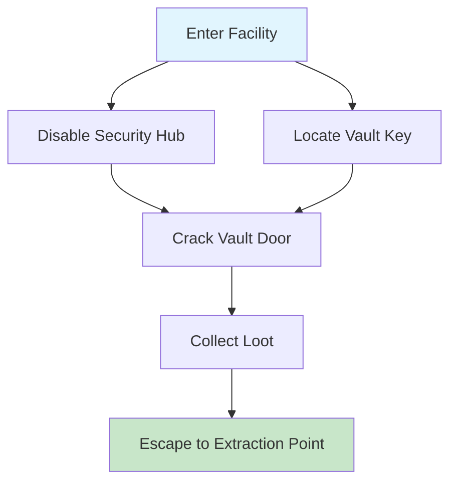

# 02_Multiplayer_Heist.md
## Destination: conker-live-and-uncut-fan/Docs/GDD/02_Multiplayer_Heist.md

# Game Design Document: Conker: Live & Uncut — Multiplayer Heist Mode

> **Document ID:** GDD-002  
> **Version:** 0.1.0  
> **Status:** Draft — AI-Generated First Pass  
> **Last Updated:** 2026-04-12  
> **Author:** GAMEMODE.ai Codegen System

---

## 1. Mode Overview

**Heist** is a team-based asymmetric multiplayer mode where one team plays as **Thieves** attempting to rob a secured vault, while the other plays as **Guards** defending the facility. The mode emphasizes stealth, coordination, and dynamic objective completion over pure combat.

### 1.1 Core Loop
```
Setup Phase (60s)
├─ Thieves: Choose loadout, plan approach routes
└─ Guards: Place traps, set patrol paths, review blueprints

Infiltration Phase (5-8 min)
├─ Thieves: Navigate facility, disable security, crack vault
├─ Guards: Patrol, detect intruders, respond to alarms
└─ Dynamic Events: Power outages, backup arrivals, environmental hazards

Extraction Phase (2 min)
├─ Thieves: Escape with loot before lockdown
└─ Guards: Contain thieves or eliminate all targets

Scoring & Rewards
├─ Thieves: Bonus for stealth, speed, loot value
└─ Guards: Bonus for early detection, trap efficiency, zero breaches
```

### 1.2 Win Conditions
| Team | Primary Win | Secondary Win | Loss Condition |
|------|------------|--------------|---------------|
| **Thieves** | Extract with ≥70% of target loot value | Extract any loot before timer expires | All thieves eliminated OR vault not cracked |
| **Guards** | Eliminate all thieves before extraction | Prevent vault breach OR recover all loot | Vault breached AND thieves escape with loot |

### 1.3 Map Design Principles
- **Modular Layout:** Facility composed of interchangeable rooms (lobby, server room, vault, etc.) for procedural variation
- **Verticality:** Multi-floor designs with ladders, vents, and breakable floors for flanking routes
- **Stealth Opportunities:** Shadows, noise mechanics, and line-of-sight blockers reward careful play
- **Dynamic Elements:** Movable crates, hackable terminals, and destructible walls enable emergent strategies

---

## 2. Gameplay Mechanics

### 2.1 Thief Abilities & Tools
| Tool | Function | Cooldown/Usage | Counterplay |
|------|----------|---------------|------------|
| **Lockpick Kit** | Opens standard doors/locks silently | 30s cooldown per lock | Guard proximity detection |
| **EMP Grenade** | Disables electronics in radius for 10s | 1 per round | Guard can repair terminals |
| **Decoy Device** | Creates fake noise signature to distract guards | 45s cooldown | Guards can identify decoys with scanner |
| **Vault Drill** | Progressively cracks vault door; requires channeling | Interruptible by damage | Guards can interrupt drilling |
| **Smoke Bomb** | Obscures vision in area for 8s | 1 per round | Guards with thermal vision ignore smoke |

### 2.2 Guard Abilities & Tools
| Tool | Function | Cooldown/Usage | Counterplay |
|------|----------|---------------|------------|
| **Security Camera** | Reveals thief positions in radius | Place 3 per round | Thieves can disable with EMP |
| **Motion Sensor** | Alerts guards to movement in hallway | Place 2 per round | Thieves can crawl to avoid detection |
| **Alarm Trigger** | Calls backup guards to location | 60s cooldown | Thieves can cut power to disable |
| **Flashbang** | Disorients thieves in radius | 1 per round | Thieves can wear sunglasses (loadout choice) |
| **K-9 Unit** | AI dog that tracks thief scent trails | Summon once per round | Thieves can use scent-masking spray |

### 2.3 Stealth & Detection System
Detection is modeled as a continuous awareness score rather than binary "seen/not seen":

```
Awareness(t+Δt) = Awareness(t) + Visibility × Δt - Decay × Δt

Where:
- Visibility = BaseDetectability × f_distance(d) × f_light(L) × f_posture(P) × f_noise(N)
- f_distance(d) = max(0, 1 - d/d_max)          // Linear falloff with distance
- f_light(L) = L^α, α > 1                      // Bright light exponentially increases risk
- f_posture(P) = { Standing: 1.0, Crouched: 0.6, Prone: 0.3 }
- f_noise(N) = { Silent: 0.5, Walking: 1.0, Running: 1.5, Sprinting: 2.0 }
```

**State Transitions:**
- `Awareness < 0.3` → Idle/Patrol
- `0.3 ≤ Awareness < 0.7` → Suspicious/Investigate
- `Awareness ≥ 0.7` → Alert/Attack

*Implementation Note: All parameters exposed to Lua for tuning; Rust core handles deterministic calculation.*

### 2.4 Objective DAG (Directed Acyclic Graph)
Heist objectives form a dependency graph to enable multiple completion paths:



**Graph Properties:**
- **Reachability:** At least one valid path from start to extraction must exist
- **Branching Factor:** Average out-degree ≤ 2.5 to avoid overwhelming players
- **No Dead Ends:** Every objective must either lead to completion or have an alternative route

*Validation: CI job runs graph analysis to ensure these properties hold for all map variants.*

---

## 3. Technical Implementation

### 3.1 UE5 Class Structure
```cpp
// Engine/Unreal/Source/Public/Multiplayer/Heist/CLUHeistGameMode.h
// (Full implementation in corresponding .cpp file)

UCLASS()
class CONKERLIVEUNCUT_API ACLUHeistGameMode : public AGameModeBase
{
    GENERATED_BODY()
    
public:
    // Match state management
    UPROPERTY(EditDefaultsOnly, Category = "Heist")
    TEnumAsByte<EHeistMatchPhase> CurrentPhase;
    
    // Team configuration
    UPROPERTY(EditDefaultsOnly, Category = "Teams")
    int32 MaxThieves;
    UPROPERTY(EditDefaultsOnly, Category = "Teams")
    int32 MaxGuards;
    
    // Objective system
    UFUNCTION(BlueprintCallable, Category = "Objectives")
    void RegisterObjective(FHeistObjectiveDef Def);
    
    // Replication hooks
    UFUNCTION(Server, Reliable)
    void Server_UpdateAwareness(AActor* Thief, float NewAwareness);
};
```

### 3.2 Knowledge Graph Registration
This mode is indexed as:
```json
{
  "id": "systems.conker.multiplayer.heist",
  "type": "GameMode",
  "tags": ["Multiplayer", "Asymmetric", "Stealth", "ObjectiveBased"],
  "path": "Engine/Unreal/Source/Public/Multiplayer/Heist/CLUHeistGameMode.h",
  "dependencies": [
    "systems.conker.core.stealth",
    "systems.conker.core.objectives",
    "systems.conker.core.networking"
  ],
  "ai_generation_rules": {
    "determinism_required": true,
    "replication_strategy": "authoritative_server",
    "tuning_via_lua": true
  }
}
```

### 3.3 Lua Scripting Interface
Heist logic is configurable via Lua scripts:
```lua
-- scripts/heist/defaults.lua
Heist.Config {
  awareness_decay_rate = 0.02,
  vault_drill_time_seconds = 45,
  extraction_timer_seconds = 120,
  loot_value_distribution = {
    { item = "gold_bars", value = 100, probability = 0.3 },
    { item = "data_drive", value = 250, probability = 0.1 },
    -- ... more items
  }
}

Heist.RegisterObjective {
  id = "disable_security_hub",
  type = "interaction",
  location = { x = 120, y = -45, z = 10 },
  completion_condition = function(world_state)
    return world_state.terminal_power == false
  end
}
```

---

## 4. Balance & Progression

### 4.1 Scoring System
| Action | Thief Points | Guard Points |
|--------|-------------|-------------|
| Disable camera | +10 | -5 |
| Crack vault section | +25 | -15 |
| Eliminate opponent | +15 | +20 |
| Successful extraction | +100 + loot bonus | -50 |
| Prevent breach | - | +75 |

### 4.2 Unlockable Content (Cosmetic Only)
- **Thieves:** Alternate outfits, tool skins, emotes
- **Guards:** Uniform variants, trap visual effects, voice lines
- **Maps:** Community-created facility layouts (vetted for balance)

*Note: No gameplay-affecting unlocks to preserve competitive integrity.*

### 4.3 Difficulty Scaling
For public matchmaking, dynamic difficulty adjusts based on team performance:
```
Guard_AI_Aggression = Base_Aggression × (1 + 0.1 × Thief_Win_Rate)
Thief_Tool_Cooldown = Base_Cooldown × (1 - 0.05 × Guard_Win_Rate)
```
*Parameters capped to prevent runaway feedback loops; exposed to Lua for tuning.*

---

## 5. Testing & Validation

### 5.1 Determinism Checks
- Replay identical input sequences across client/server → verify identical world state hashes
- Test objective DAG completion under all valid player action combinations

### 5.2 Netcode Stress Tests
- Simulate 500ms latency + 50ms jitter → ensure rollback correction maintains fairness
- Verify awareness calculations remain consistent across network conditions

### 5.3 AI-Chat Generation Prompts
Example prompt for AI-assisted development:
```
Generate a full implementation for 
Engine/Unreal/Source/Private/Multiplayer/Heist/CLUHeistGameMode.cpp 
that:
- Supports team setup with 4v4 player limits
- Implements the awareness calculation formula from GDD-002
- Includes replication hooks for vault drill progress
- Uses the Objective DAG structure for mission flow
Reference the public header at 
Engine/Unreal/Source/Public/Multiplayer/Heist/CLUHeistGameMode.h
```

---

## 6. Next Objectives

### 6.1 Immediate AI-Chat Tasks
1. Generate `Docs/GDD/03_Multiplayer_War.md` using this document's structure as template
2. Create initial `CLUHeistGameMode.cpp` implementation stub with awareness system
3. Add Heist mode entries to `knowledgegraphsystems.json` via repo_index_generator

### 6.2 Human Review Checklist
- [ ] Confirm asymmetric balance feels fair in playtesting
- [ ] Validate stealth detection math produces intuitive player feedback
- [ ] Approve Lua scripting interface before exposing to community modders
- [ ] Sign off on cosmetic-only progression system

---

*This document is part of the Conker: Live & Uncut fan project. All content is fan-created and non-commercial. Conker and related properties are trademarks of their respective owners.*
